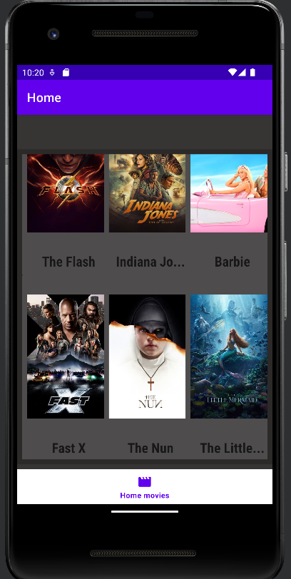
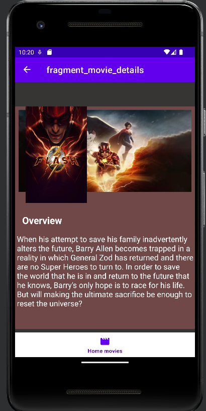
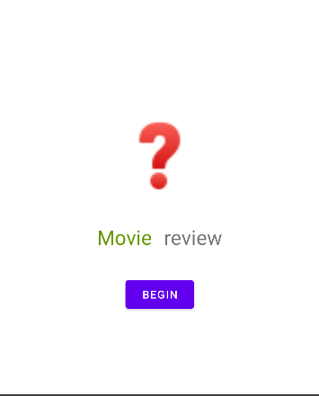
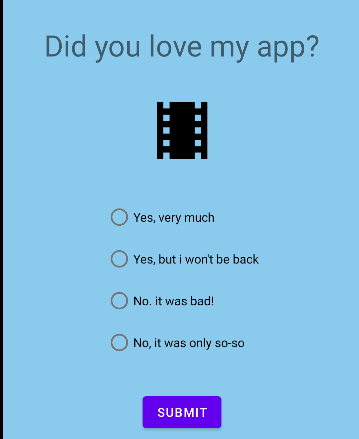
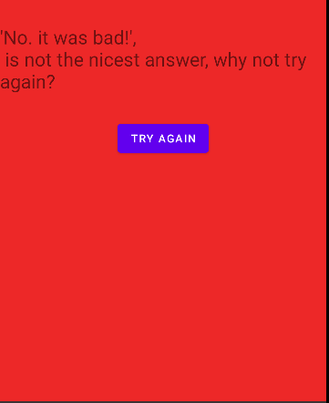

# TMDB
This is an android application that shows Lists of movies

## Features
- Discover Popular, Top Rated and Now Playing movies on TMDb.
- View movie details like release date, rating, tagline and overview inside the app.
- Answer a little review/game on the app.

## Architecture and Tech features
- Fully written in Kotlin language.
- Built on MVVM architecture pattern.
- Uses Android Architecture Components, specifically ViewModel and LiveData.
- Uses Retrofit for making API calls.
- Uses Picasso for image loading.

## Screenshots

